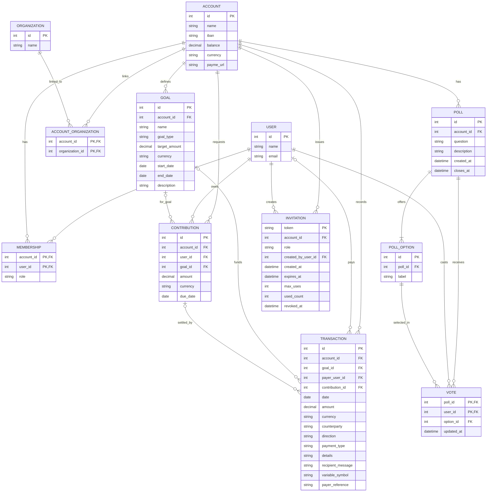

# Community Wallet Data Model

The backend stores its demo data in CSV files under `backend/data`. The diagram shows the logical relationships between those files; CSV does not enforce foreign keys or unique constraints itself.

## CSV Files

| File | Purpose |
| --- | --- |
| `users.csv` | Demo people who may participate in communities |
| `accounts.csv` | Community accounts and their displayed balance/payment details |
| `memberships.csv` | User-to-account relationship and that user's role on that account |
| `organizations.csv` | Legal entities |
| `account_organizations.csv` | Links legal entities to community accounts |
| `goals.csv` | Permanent or temporary account goals |
| `transactions.csv` | Credits and debits recorded on an account |
| `contributions.csv` | Expected contribution amount per account member |
| `polls.csv` | Poll question, account and closing time |
| `poll_options.csv` | Choices offered by a poll |
| `votes.csv` | One changeable vote per user and poll until closing |
| `invitations.csv` | Expiring, use-limited read-only invite links |

## Derived Data and Limitations

- `memberships.role` is scoped to one account. A user can be an `admin` in one account and `read_only` in another.
- Goal progress and contribution payment status are calculated from linked credit transactions; those totals/statuses are not stored in their CSV files.
- Vote rows retain `user_id` to enforce one vote per member, but poll API responses expose aggregate counts only. Votes may be changed until the poll closes.
- Invitations grant only `read_only`; the returned `invite_path` is intended to be encoded as a QR code by the frontend.
- This is a public demo without authentication. User IDs supplied to write endpoints can be spoofed, so role checks are illustrative and not suitable for real financial accounts.
- Account ownership is not modeled yet. `account_organizations.csv` means an organization is associated with an account; it does not prove legal ownership. Transaction `counterparty` is currently free text.
- The IBANs in demo data are intentionally invalid and must not be used for payments.